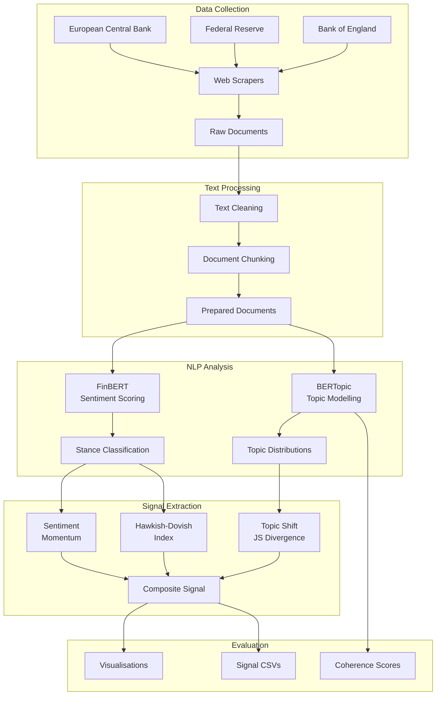

# NLP Financial Signals

**Unsupervised NLP pipeline for extracting financial signals from central bank communications using BERTopic and FinBERT.**


> MSc Applied AI Dissertation Project — University of Warwick, 2025–2026

---

## Motivation

Central banks communicate monetary policy intent through speeches, minutes, and press conferences. These communications contain implicit signals about future policy direction — hawkish (tightening) or dovish (easing) — that precede formal rate decisions. However, the volume and complexity of this text makes manual analysis impractical.

This project builds an end-to-end pipeline that transforms unstructured central bank communications into structured financial signals by combining **unsupervised topic modelling** (BERTopic) with **domain-specific sentiment analysis** (FinBERT). The pipeline processes documents from three major central banks — the Bank of England, Federal Reserve, and European Central Bank — and produces a composite hawkish/dovish indicator that can be correlated with market movements.

---

## Data Sources

| Source | Document Types | Date Range | Collection Method |
|--------|---------------|------------|-------------------|
| **Bank of England** | Speeches, MPC minutes | 2015–2025 | Web scraping (BeautifulSoup) |
| **Federal Reserve** | Speeches, FOMC minutes | 2015–2025 | Web scraping (BeautifulSoup) |
| **European Central Bank** | Speeches, Policy accounts | 2015–2025 | Web scraping (BeautifulSoup) |

Sample data (200 synthetic documents) is bundled for offline testing.

---

## Methodology

### Topic Modelling (BERTopic)

Documents are embedded using sentence-transformers (`all-MiniLM-L6-v2`), reduced via UMAP, and clustered with HDBSCAN. BERTopic discovers latent themes in central bank communications (e.g., inflation outlook, labour market, financial stability). Topic evolution over time reveals shifts in policy focus.

### Sentiment Analysis (FinBERT)

Each document and paragraph is scored using ProsusAI/finbert, producing positive, negative, and neutral probabilities. A compound score (positive − negative) captures overall sentiment polarity. Documents are further classified as **hawkish**, **dovish**, or **neutral** using a combination of sentiment scores and monetary policy keyword matching.

### Signal Extraction

Three components are combined into a composite financial signal:

1. **Sentiment Level** (weight: 0.4) — Absolute hawkish/dovish stance
2. **Topic Shift** (weight: 0.3) — Jensen-Shannon divergence between consecutive monthly topic distributions
3. **Sentiment Momentum** (weight: 0.3) — Rate of change in sentiment over a 3-month window

---

## Architecture



---

## Results (Sample Data)

| Metric | Value |
|--------|-------|
| Topics Discovered | 5 |
| Documents Analysed | 200 |
| Outlier Documents | 0% |
| Monthly Signals | 126 |
| Hawkish Months | 44 (34.9%) |
| Dovish Months | 15 (11.9%) |
| Neutral Months | 67 (53.2%) |

**Note:** Results shown are from synthetic sample data. Real-world performance depends on the quality and volume of scraped documents.

---

## Quick Start

```bash
# 1. Clone the repository
git clone https://github.com/VishalKJ-ai/nlp-financial-signals.git
cd nlp-financial-signals

# 2. Create virtual environment
python -m venv .venv && source .venv/bin/activate

# 3. Install dependencies
pip install -r requirements.txt

# 4. Run with sample data (no scraping required)
python -m src.pipeline --mode sample

# 5. View results
ls outputs/figures/      # Evaluation plots
ls outputs/signals/      # Signal CSVs
```

### Docker

```bash
docker compose up                            # Sample mode
docker compose run signals --mode full       # Full pipeline
```

---

## Configuration

All parameters are centralised in `config/config.yaml`:

```yaml
topics:
  embedding_model: "all-MiniLM-L6-v2"
  nr_topics: "auto"
  min_topic_size: 10
  umap:
    n_neighbors: 15
    n_components: 5

sentiment:
  model_name: "ProsusAI/finbert"
  batch_size: 32

signals:
  composite_weights:
    topic_shift: 0.3
    sentiment_level: 0.4
    sentiment_change: 0.3
```

---

## Project Structure

```
nlp-financial-signals/
├── config/config.yaml              # Centralised configuration
├── data/
│   └── sample/                     # Bundled sample data (200 documents)
├── src/
│   ├── pipeline.py                 # Main orchestrator (3 modes)
│   ├── data/
│   │   ├── boe_scraper.py          # Bank of England scraper
│   │   ├── fed_scraper.py          # Federal Reserve scraper
│   │   ├── ecb_scraper.py          # ECB scraper
│   │   └── preprocessor.py         # Text cleaning and chunking
│   ├── topics/
│   │   └── topic_model.py          # BERTopic wrapper
│   ├── sentiment/
│   │   └── finbert_scorer.py       # FinBERT sentiment scorer
│   ├── signals/
│   │   └── extractor.py            # Composite signal extraction
│   └── evaluation/
│       └── evaluator.py            # Metrics and visualisations
├── tests/                          # pytest test suite
├── notebooks/exploration.ipynb     # Exploratory data analysis
├── Dockerfile                      # Container build
├── docker-compose.yml              # Multi-service orchestration
└── .github/workflows/pipeline.yml  # Automated monthly analysis
```

---

## Running Tests

```bash
pytest tests/ -v --tb=short
```

---

## Tech Stack

| Component | Library | Version |
|-----------|---------|---------|
| Topic Modelling | BERTopic | 0.16.0 |
| Embeddings | sentence-transformers | 2.5.1 |
| Dimensionality Reduction | UMAP | 0.5.5 |
| Clustering | HDBSCAN | 0.8.33 |
| Sentiment Analysis | transformers (FinBERT) | 4.38.2 |
| Deep Learning | PyTorch | 2.2.1 |
| Coherence Metrics | Gensim | 4.3.2 |
| Web Scraping | BeautifulSoup4 | 4.12.3 |
| Data Processing | pandas, NumPy | 2.2.1, 1.26.4 |
| Visualisation | matplotlib, seaborn | 3.8.3, 0.13.2 |
| Testing | pytest | 8.0.2 |

---

## Limitations

- **Sample data:** Synthetic documents lack the nuance of real central bank communications
- **Scraper fragility:** Web scrapers depend on page structure that may change
- **No real-time processing:** Batch pipeline only, not suitable for live trading signals
- **Limited validation:** Signal correlation with markets requires historical market data
- **Single language:** English documents only (ECB publishes in multiple languages)
- **Coherence metrics:** Require Gensim; fall back to zero when unavailable

## Future Work

- Integrate additional NLP models (GPT-based zero-shot classification)
- Add Streamlit dashboard for interactive exploration
- Implement rolling backtesting framework for signal evaluation
- Extend to additional central banks (RBA, BOJ, SNB)
- Add probabilistic forecasting of rate decisions
- MLflow integration for experiment tracking
- Real-time scraping with Airflow/Prefect scheduling

---

## Author

**Vishal Joshi**
MSc Applied Artificial Intelligence, University of Warwick (2025–2026)

*This project demonstrates proficiency in unsupervised NLP, transformer-based sentiment analysis, and financial signal extraction from unstructured text data.*
