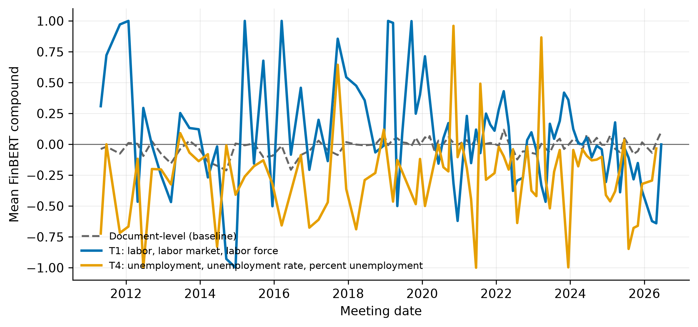
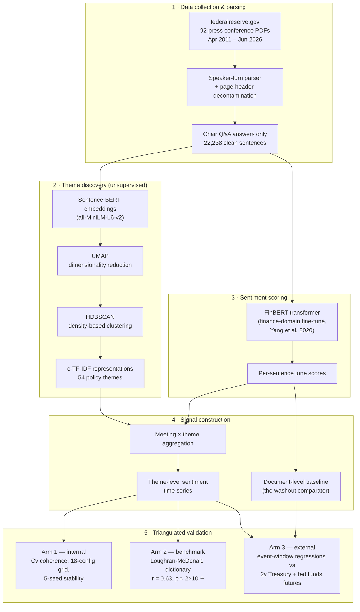

# NLP Financial Signals

**A transformer-based NLP pipeline that turns Federal Reserve press conferences into theme-level sentiment signals — and shows why the industry-standard approach destroys the signal it claims to measure.**


> MSc Applied AI Dissertation Project — University of Warwick, 2025–2026

---

## The one-minute version

When the Fed Chair speaks, markets move. A whole industry scores the "sentiment" of these communications — almost always as **one number per document**. This project demonstrates that the single number is close to meaningless *by construction*: a press conference is routinely optimistic about the economy and pessimistic about unemployment **at the same time**, and averaging opposing signals cancels them to zero. I call this **signal washout**.

The pipeline fixes it. It reads all **92 Fed press conferences since 2011**, uses transformer language models to discover *what* the Chair is talking about (unsupervised — no labels, no keyword lists) and *how* he talks about each theme, and outputs a **per-theme sentiment time series** instead of one washed-out score. The theme-level signals explain roughly **20× more** of the market's meeting-day reaction than the document-level score they replace.



*The problem in one picture: the industry-standard document-level score (grey, dashed) is flat at zero for fifteen years. The theme-level series it is hiding — labour market (blue) vs unemployment (orange) — are large, persistent, and point in opposite directions. The information was always in the text; averaging destroyed it.*

---

## Architecture



Every stage persists its artefacts (embeddings, cluster assignments, scores), so any stage re-runs independently and every figure/table regenerates from a script.

---

## Results at a glance

| Question | Answer |
|---|---|
| Does unsupervised clustering find real policy themes? | Yes — inflation expectations, labour market, rate path, QE, banking supervision, housing emerge with **no supervision** (54 topics, Cv 0.663, chosen from an 18-configuration grid by a pre-fixed rule) |
| Is it stable? | Substantively yes — 4/5 random seeds give 54–56 topics with the same themes; one seed merges them more coarsely (reported honestly) |
| Does washout actually happen? | Directly demonstrated — document series: mean −0.015, σ 0.062; theme series diverge to ±0.26 with opposite signs |
| Does it agree with the established benchmark? | Meeting-level r = 0.63 with the Loughran-McDonald dictionary — passes the pre-specified falsification test |
| Does it carry market-relevant information? | Theme-level R² ≈ 0.127 vs 0.006 for the document baseline on meeting-day 2-year yield moves; household-sector themes individually significant (honest caveat: underpowered at n = 92; nothing survives multiple-testing correction) |

Two findings worth knowing about beyond the headline: **coherence metrics certify junk** (procedural clusters like "we're watching that carefully" score well on coherence while carrying zero policy content — which is why validation is triangulated), and **tone ≠ policy stance** (pessimistic unemployment language is *dovish*, not hawkish — the mapping from sentiment to policy meaning is theme-dependent).

---

## Technical decisions that matter

- **Sentence-level units from the Chair's Q&A answers only.** Opening statements are prepared text; journalist questions are noise. Restricting the register isolates the authoritative, spontaneous policy voice.
- **BERTopic over LDA.** Central bank language is polysemous ("transitory", "patient", "accommodation" carry policy-specific meanings). Bag-of-words models cannot see this; contextual embeddings can.
- **HDBSCAN over k-means.** No a-priori topic count, and ambiguous sentences become outliers rather than contaminating clusters.
- **FinBERT variant chosen deliberately** — the Yang et al. (2020) model, trained on financial communications rather than news. Implementation gotcha caught in testing: the two published FinBERT variants order their output labels differently, so label maps are read from the model config at runtime — hardcoding would have silently swapped neutral and positive.
- **Configuration by rule, not taste.** The topic model configuration was selected by a rule fixed before inspecting results (within 0.03 Cv of grid max → lowest outlier share), with the full 18-configuration grid and 5-seed stability analysis published.
- **Data quality found the hard way.** PDF extraction splices running page headers into mid-sentence text ("It *March 21, 2018 Chairman Powell's Press Conference FINAL Page 7 of 22* would take…"). An early run produced an entire spurious topic of these fragments — caught by qualitative inspection, fixed with regression tests. 216 contaminated units excised.
- **Honest statistics.** Heteroscedasticity-robust errors, Benjamini-Hochberg multiple-testing correction, and a results chapter that reports what *didn't* survive correction as plainly as what did.

---

## Quick start

```bash
git clone https://github.com/VishalKJ-ai/nlp-financial-signals.git
cd nlp-financial-signals
python -m venv .venv && source .venv/bin/activate
pip install -r requirements-lock.txt

# Collect the corpus (~92 PDFs, rate-limited, public domain)
python -m src.data.fomc_presser_scraper

# Staged pipeline — each stage persists its artefacts
python -m src.dissertation_pipeline --stage prepare
python -m src.dissertation_pipeline --stage topics
python -m src.dissertation_pipeline --stage sentiment
python -m src.dissertation_pipeline --stage aggregate

# Evaluation arms (LM master dictionary: download from https://sraf.nd.edu
# into data/external/Loughran-McDonald_MasterDictionary.csv first)
python -m src.evaluation.lm_baseline
python -m src.evaluation.market_validation

# Robustness + all figures
python -m src.dissertation_pipeline --stage grid
python -m src.dissertation_pipeline --stage stability
python -m src.evaluation.dissertation_figures

# Tests
pytest tests/ -v
```

All parameters live in `config/dissertation.yaml` with fixed seeds; frozen results ship in `outputs/dissertation/`.

---

## Repository layout

```
nlp-financial-signals/
├── config/dissertation.yaml            # All parameters + seeds (single source of truth)
├── src/
│   ├── dissertation_pipeline.py        # Staged orchestrator
│   ├── data/
│   │   ├── fomc_presser_scraper.py     # Transcript download + speaker parsing
│   │   └── presser_preprocessor.py     # Disfluency cleaning + sentence units
│   ├── sentiment/finbert_scorer.py     # FinBERT inference (variant-agnostic labels, MPS/CUDA)
│   └── evaluation/
│       ├── lm_baseline.py              # Loughran-McDonald benchmark (Arm 2)
│       ├── market_validation.py        # Market event-study regressions (Arm 3)
│       └── dissertation_figures.py     # Every figure, scripted
├── tests/                              # pytest suite (parsing, cleaning, scoring, event windows)
└── outputs/dissertation/               # Frozen tables, series, figures
```

An earlier multi-bank prototype (BoE/Fed/ECB, `src/pipeline.py`) is retained as an extension direction — replicating the washout analysis on ECB press conferences is the natural next step, alongside intraday event windows and a hawkish/dovish stance classifier dropped into the same cluster-level architecture.

## Tech stack

BERTopic · sentence-transformers · HuggingFace Transformers (FinBERT) · UMAP · HDBSCAN · Gensim (Cv coherence) · statsmodels · pandas · matplotlib · pytest · Docker · GitHub Actions

## Ethics & licensing

FOMC transcripts are public-domain institutional records; no human-subject concerns. FinBERT and Sentence-BERT are Apache-2.0 via Hugging Face; the LM dictionary is free for academic research (downloaded separately, not redistributed). Extracted signals are academic research outputs, not financial advice or trading signals. Code, seeds, and configuration are published for full reproducibility.

## Author

**Vishal Joshi** — MSc Applied Artificial Intelligence, University of Warwick (2025–2026)
